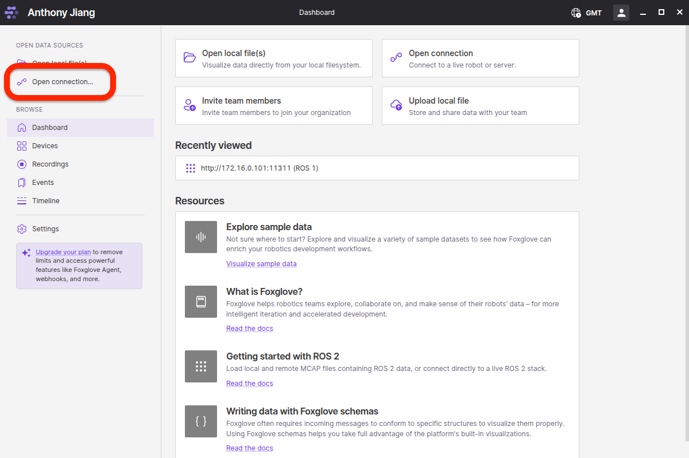
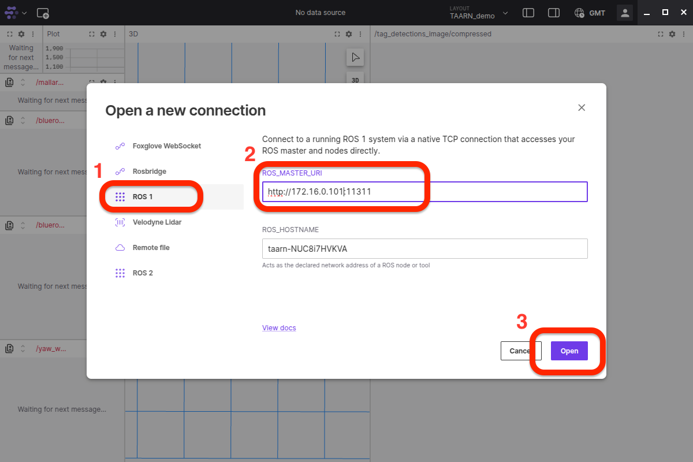
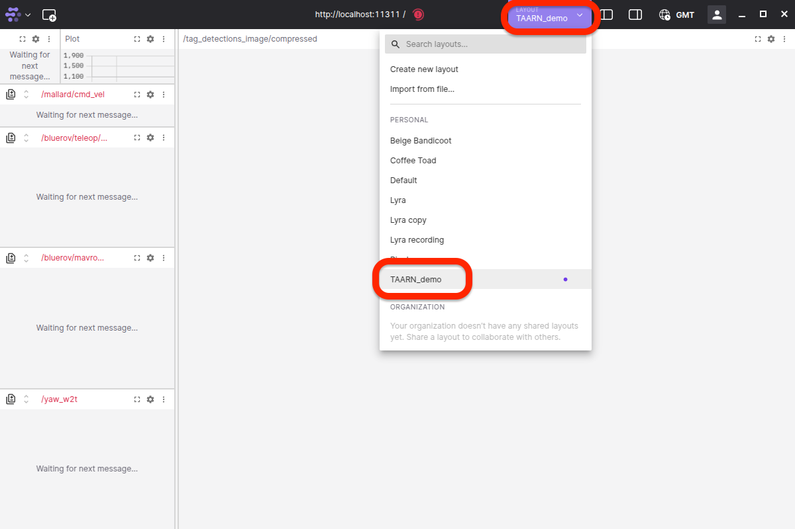

# Connection Guide

## First time setup
1. Open foxglove studio dashboard and click Open connection

2. In the popup window, follow the steps in the picture:

3. If the correct layout isn't showing up:

## Next time
From the dashboard, you should see the already set-up connection under "Recently viewed". Click that and you are good to go.
