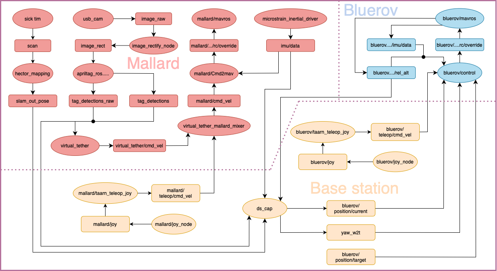

# taarn_meta
A collection of repositories for TAARN.

# Development by ICE 9
## Installation
See [Installation-ice9-development](Installation-ice9-development.md)

## User manual
See [Software-user-manual](SOFTWARE_USER_MANUAL.md)

## ROS setup diagram:
```yaml
LEGEND:
  Oval: ROS node
  Rectangle: ROS topic
```


## A list of repositories:

#### Base station software
- Bring up ROS package: [EEEManchester/taarn_basestation_ros](https://github.com/EEEManchester/taarn_basestation_ros/tree/main) _main branch_

#### MallARD software
- MallARD meta: [EEEManchester/MallARD](https://github.com/EEEManchester/MallARD/tree/ice9-dev) _ice9-dev branch_

&nbsp;&nbsp;&nbsp;&nbsp;&nbsp;&nbsp;&nbsp;&nbsp;&nbsp;&nbsp;&nbsp;&nbsp;The original MallARD meta repository with added attitude control and refactored ds_cap package.

- Bring up ROS package: [EEEManchester/taarn_mallard_onboard](https://github.com/EEEManchester/taarn_mallard_onboard/tree/main) _main branch_

&nbsp;&nbsp;&nbsp;&nbsp;&nbsp;&nbsp;&nbsp;&nbsp;&nbsp;&nbsp;&nbsp;&nbsp;A ROS package contains custom launch files and parameter definitions for launching all ROS nodes on MallARD's on-board computer.

#### Bluerov software
- Bluerov meta: [EEEManchester/taarn_bluerov](https://github.com/EEEManchester/taarn_bluerov/tree/main) _main branch_

&nbsp;&nbsp;&nbsp;&nbsp;&nbsp;&nbsp;&nbsp;&nbsp;&nbsp;&nbsp;&nbsp;&nbsp;A meta repository for Bluerov, similar to the MallARD repository.

- Bring up ROS package: [EEEManchester/taarn_bluerov_onboard](https://github.com/EEEManchester/taarn_bluerov_onboard/tree/main) _main branch_

&nbsp;&nbsp;&nbsp;&nbsp;&nbsp;&nbsp;&nbsp;&nbsp;&nbsp;&nbsp;&nbsp;&nbsp;A ROS package for custom launch files and parameter definitions for launching all ROS nodes on Bluerov's on-board computer.

#### Other
- Visual virtual tether: [EEEManchester/visual_virtual_tether](https://github.com/EEEManchester/visual_virtual_tether/tree/main) _main branch_

# Deverlopment by Tom Breeze (legacy)
### Base station software
- ros2: [EEEManchester/taarn](https://github.com/EEEManchester/taarn)
- ros2: [EEEManchester/taarn_mallard](https://github.com/EEEManchester/taarn_mallard/)
- ros2: [EEEManchester/taarn_bluerov](https://github.com/EEEManchester/taarn_bluerov/tree/tb-ros2-teleop) _tb-ros2-teleop branch_
- ros1: [EEEManchester/taarn_mallard_basestation](https://github.com/EEEManchester/taarn_mallard_basestation)
- ros1: [EEEManchester/taarn_ros1_basestation](https://github.com/EEEManchester/taarn_ros1_basestation)
### Mallard software
- ros1: [EEEManchester/taarn_mallard_onboard](https://github.com/EEEManchester/taarn_mallard_onboard/tree/tb) _tb branch_
### Bluerov softare
- ros1: [EEEManchester/taarn_bluerov_onboard](https://github.com/EEEManchester/taarn_bluerov_onboard/tree/tb-bluerov-control) _tb-bluerov-control branch_
